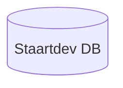
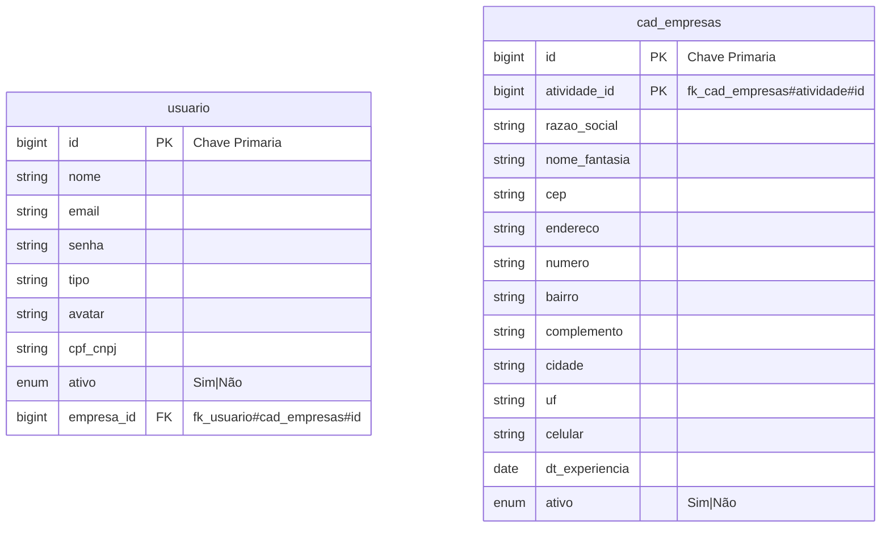
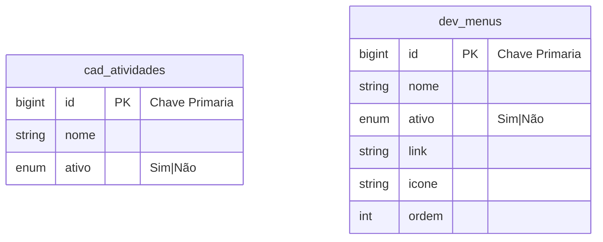
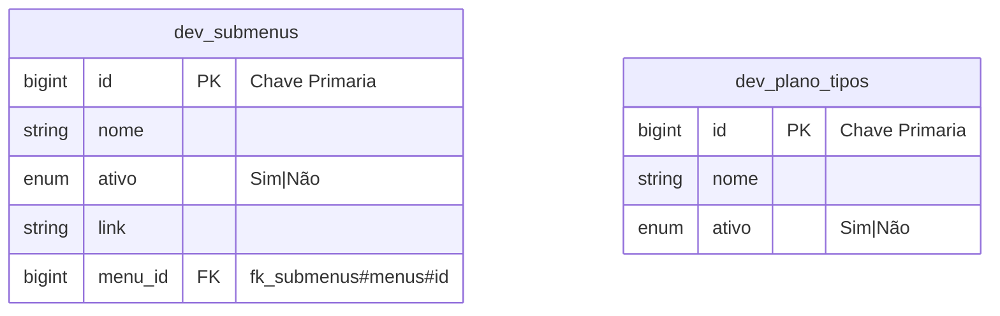
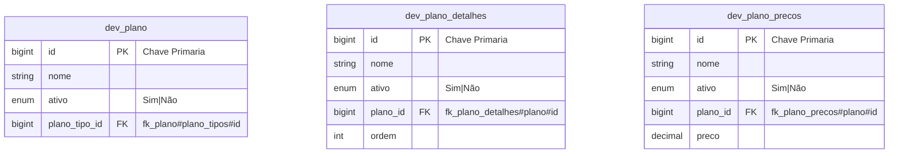
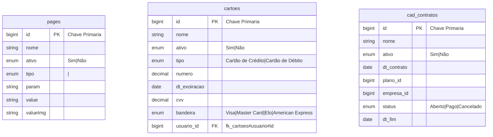
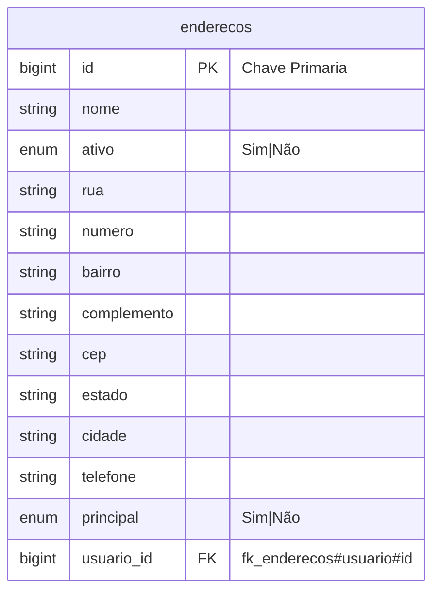

# Diagrama de Entidade Relacional - Adminstrador

> Documentação [mermaid](https://mermaid-js.github.io/mermaid/#/)

## Configurar relacionamento
---
| Value (left) | Value (right) | Meaning |
|--- |--- |--- |
| \|o | o\| | Zero or one |
| \|\| | \|\| | Exactly one |
| }o | o{ | Zero or more (no upper limit) |
| }\| | \|{ | One or more (no upper limit) |
---
## Database
---

---
## Entidade Relacional
---
```mermaid
erDiagram
  usuario ||--|| cad_empresas : "1 -> 1"
  cad_empresas ||--|| cad_atividades : "1 -> 1"
  cad_empresas ||--|| cad_contratos : "1 -> x"
  dev_plano ||--|| cad_contratos : "1 -> 1"
  usuario ||--|{ cad_cartoes : "1 -> x"
  usuario ||--|{ enderecos : "1 -> x"
  dev_menus ||--|{ dev_submenus : "1 -> x"
    
  dev_plano_tipos ||--|{ dev_plano "1 -> x"
  dev_plano_precos ||--|| dev_plano "1 -> x"
  dev_plano ||--|{ dev_plano_precos "1 -> x"
  dev_plano ||--|{ dev_plano_detalhes "1 -> x"
```
---
## Tabelas
---






---