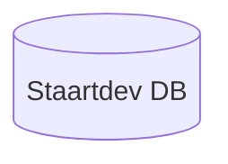
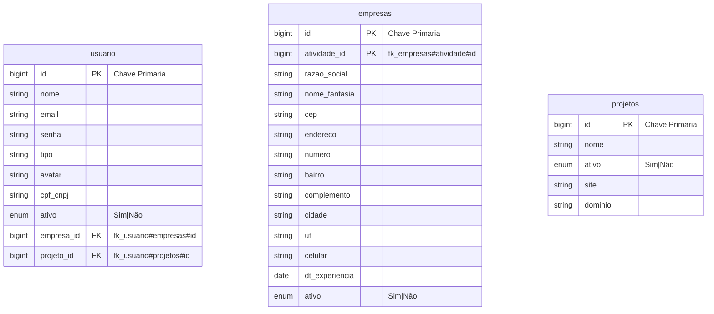
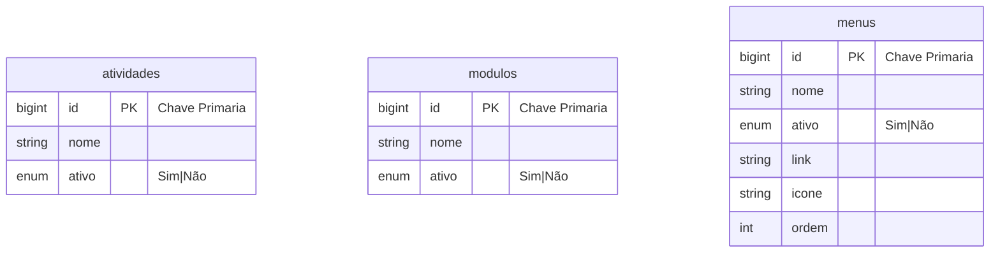
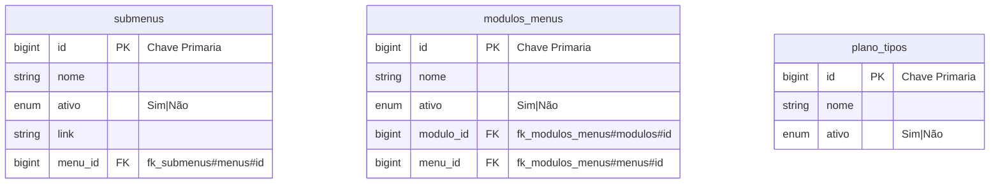
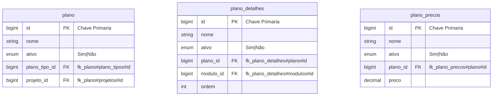
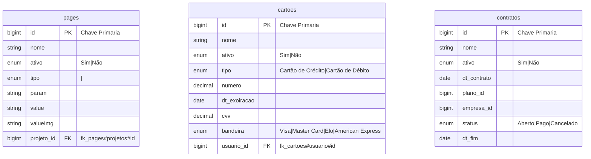
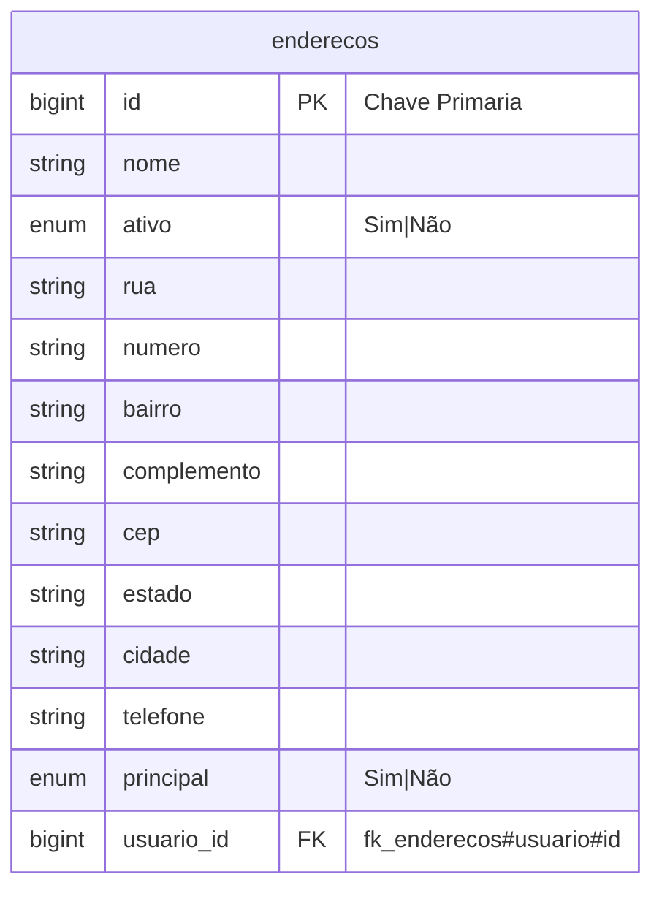

# Diagrama de Entidade Relacional - Adminstrador

> Documentação [mermaid](https://mermaid-js.github.io/mermaid/#/)

## Configurar relacionamento
---
| Value (left) | Value (right) | Meaning |
|--- |--- |--- |
| \|o | o\| | Zero or one |
| \|\| | \|\| | Exactly one |
| }o | o{ | Zero or more (no upper limit) |
| }\| | \|{ | One or more (no upper limit) |
---
## Database
---

---
## Entidade Relacional
---
```mermaid
erDiagram
  usuario ||--|| empresas : "1 -> 1"
  usuario ||--|| projetos : "1 -> 1"
  empresas ||--|| atividades : "1 -> 1"
  empresas ||--|{ contratos : "1 -> x"
  usuario ||--|{ cartoes : "1 -> x"
  usuario ||--|{ enderecos : "1 -> x"
  plano ||--|{ contratos : "1 -> x"
  menus ||--|{ submenus : "1 -> x"
  modulos ||--|{ modulos_menus : "1 -> x"
  menus ||--|{ modulos_menus : "1 -> x"
  projetos ||--|{ pages "1 -> x"
  projetos ||--|{ plano "1 -> x"
  plano_tipos ||--|{ plano "1 -> x"
  projetos ||--|{ plano "1 -> x"
  plano ||--|{ plano_detalhes "1 -> x"
  plano ||--|{ plano_precos "1 -> x"
```
---
## Tabelas
---






---